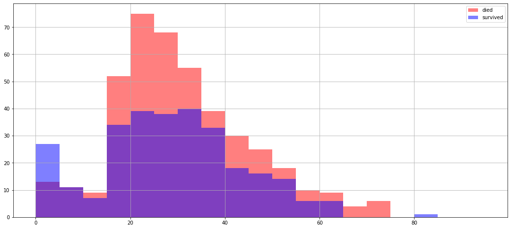
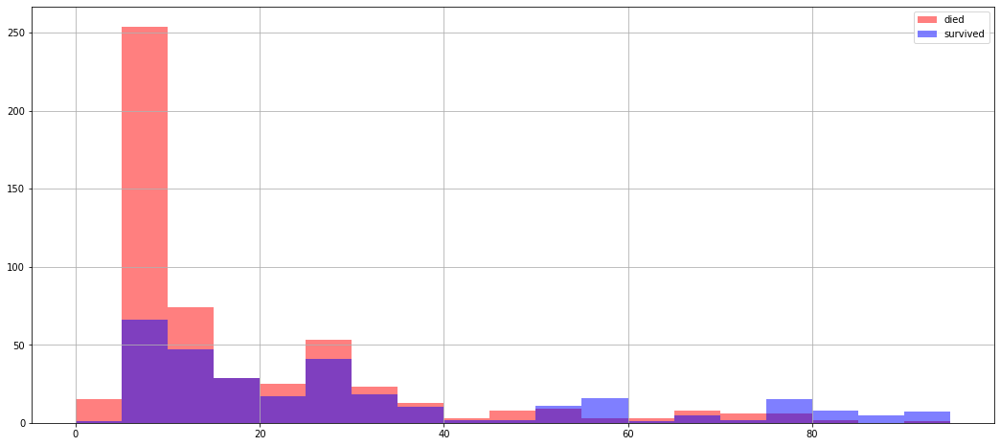
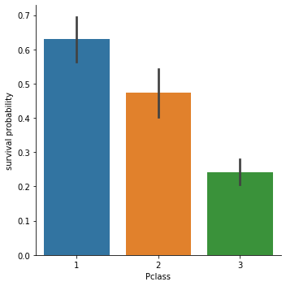
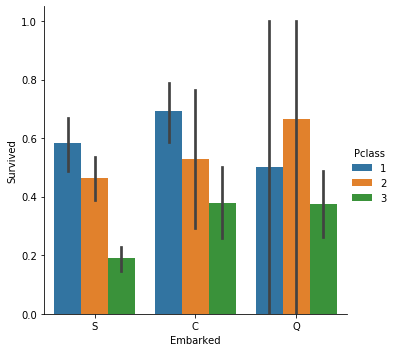
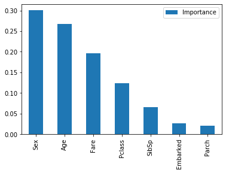

# CSE204 - Introduction to Machine Learning - Lab Session 1: Introduction


[CSE204-2019](https://moodle.polytechnique.fr/course/view.php?id=7862) Lab session #01

Jérémie DECOCK - Adrien EHRHARDT

[](https://colab.research.google.com/github/adimajo/polytechnique-cse204-2019-releases/blob/master/lab_session_01/lab_session_01.ipynb)

[](https://mybinder.org/v2/gh/adimajo/polytechnique-cse204-2019-releases/master?filepath=lab_session_01%2Flab_session_01.ipynb)

[](https://github.com/adimajo/polytechnique-cse204-2019-releases/raw/master/lab_session_01/lab_session_01.ipynb)

## Introduction

Welcome to [CSE 204](https://moodle.polytechnique.fr/course/view.php?id=7862) lab session: *Introduction to Machine Learning*.

This lab session assume you are familiar with the Python programming language.
Check [CSE 101](https://moodle.polytechnique.fr/course/view.php?id=7855), [CSE 102](https://moodle.polytechnique.fr/course/view.php?id=7856) and [CSE 103](https://moodle.polytechnique.fr/course/view.php?id=7857) if you need to refresh your knowledge.

Note that the 1st year courses used scripting tools (e.g. Spyder) and relied on relatively "low-level" abstractions (lists, numpy arrays, etc.) and manipulation techniques (e.g. for loops). While the knowledge of these concepts and tools is mandatory for this course and your future use of Python, we will concentrate in this course on Jupyter Notebooks (more on these later) and "high-level" abstractions (e.g. pandas, scikit-learn, plotting libraries) that are very commonly used in Machine Learning projects.

Additional documentation can be found there:
- [Python 3 documentation](https://docs.python.org/3/)
- [The Python Tutorial](https://docs.python.org/3/tutorial/index.html)
- [The Python Standard Library](https://docs.python.org/3/library/index.html)
- [The Python Language Reference](https://docs.python.org/3/reference/index.html)

### Jupyter Notebooks

The document you are reading is a [Jupyter Notebook](https://jupyter.org/).

The Jupyter Notebook (formerly IPython Notebooks) is a web-based interactive web application for creating documents that contain live code, equations, visualizations and narrative text. While notebooks represent a good way to build a tutorial or a report, you will still need to rely on more common, scripting IDEs like Spyder or PyCharm, when working on a "project" (e.g. by organizing functions in modules to industrialize a data science product).

The notebook consists of a sequence of cells. A cell is a multiline text input field, and **its contents can be executed** by using `Shift+Enter`, or by clicking either the `Play` button on the toolbar, or Cell, Run in the menu bar. The execution behavior of a cell is determined by the cell’s type. There are three types of cells: *code cells*, *markdown cells*, and *raw cells*. Every cell starts off being a code cell, but its type can be changed by using a drop-down on the toolbar (which will be “Code”, initially).

#### Code cells

A code cell allows you to edit and write new code, with full syntax highlighting and tab completion. The programming language used here is Python.

When a code cell is executed, code that it contains is sent to the kernel associated with the notebook. The results that are returned from this computation are then displayed in the notebook as the cell’s output. The output is not limited to text, with many other possible forms of output are also possible, including figures and HTML tables.

**Tips**:
- press the `Tab` key to use auto completion in code cells
- press `Shift+Tab` to display the documentation of the current object (the one on witch the cursor is)

See e.g. https://miykael.github.io/nipype_tutorial/notebooks/introduction_jupyter-notebook.html

#### Markdown cells

You can document the computational process in a literate way, alternating descriptive text with code, using rich text. In IPython this is accomplished by marking up text with the Markdown language. The corresponding cells are called Markdown cells. The Markdown language provides a simple way to perform this text markup, that is, to specify which parts of the text should be emphasized (italics), bold, form lists, etc. See [this cheatsheet](https://www.ibm.com/support/knowledgecenter/en/SSGNPV_1.1.3/dsx/markd-jupyter.html).

For more information about Jupyter Notebooks, read its [official documentation](https://jupyter-notebook.readthedocs.io/en/stable/notebook.html#structure-of-a-notebook-document).

#### Save your work!

Don't forget to regularly save your work!
If you call this notebook from Google Colab, you can either save the notebook in your Google Drive (if you have a Google account) or download the `.ipynb` file from the menu bar. Downloaded `.ipynb` files can then be imported from the same menu to restore your work.

## Objectives

What we will practice today:
- Pandas basics
- Making an exploratory analysis on an actual dataset
- Making a first predictive model for this dataset

## Pandas Basics

[Pandas](http://pandas.pydata.org/) is a popular data analysis toolkit for Python.

We will use it to explore data with heterogeneous types and/or missing values.

Additional documentation can be found there:
- http://pandas.pydata.org/pandas-docs/stable/getting_started/10min.html
- http://pandas.pydata.org/pandas-docs/stable/
- https://jakevdp.github.io/PythonDataScienceHandbook/
- http://www.jdhp.org/docs/notebook/python_pandas_en.html

### Import directives

To begin with, let's import the Pandas library as the *pd* alias. Select the following code cell and execute it with the `Shift + Enter` shortcut key.

We also import:
- Numpy to generate arrays
- Seaborn to make plots
- Sklearn to learn data

The `%matplotlib inline` line is a "magic" command that tells Jupyter Notebook to display figures within the document.


```python
colab_requirements = [
    "matplotlib>=3.1.2",
    "pandas>=0.25.3",
    "numpy>=1.18.1",
    "seaborn>=0.10.0",
    "scikit-learn>=0.22.1",
    "nose>=1.3.7",
    "graphviz>=0.13.2"
]
import sys, subprocess
def run_subprocess_command(cmd):
    # run the command
    process = subprocess.Popen(cmd.split(), stdout=subprocess.PIPE)
    # print the output
    for line in process.stdout:
        print(line.decode().strip())
        
if "google.colab" in sys.modules:
    for i in colab_requirements:
        run_subprocess_command("pip install " + i)
```


```python
%matplotlib inline

import pandas as pd
import numpy as np
import seaborn as sns
import sklearn
```

### Make DataFrames (2D data)

Let's make a *DataFrame* now. DataFrame is the name given to 2D arrays in Pandas. We will assign this DataFrame to the `df` variable and display it (with the `df` line at the end of the cell).

When the data carries a meaning, i.e. comes from a real data source, e.g. the `titanic` dataset, always use explicit names such as `df_titanic`. See [PEP8](https://www.python.org/dev/peps/pep-0008/), a Python code style guide, for details.


```python
data = [[1, 2, 3], [4, 5, 6]]
df = pd.DataFrame(data)
df
```


<div>
<style scoped>
    .dataframe tbody tr th:only-of-type {
        vertical-align: middle;
    }

    .dataframe tbody tr th {
        vertical-align: top;
    }

    .dataframe thead th {
        text-align: right;
    }
</style>
<table border="1" class="dataframe">
  <thead>
    <tr style="text-align: right;">
      <th></th>
      <th>0</th>
      <th>1</th>
      <th>2</th>
    </tr>
  </thead>
  <tbody>
    <tr>
      <th>0</th>
      <td>1</td>
      <td>2</td>
      <td>3</td>
    </tr>
    <tr>
      <th>1</th>
      <td>4</td>
      <td>5</td>
      <td>6</td>
    </tr>
  </tbody>
</table>
</div>


The previous command has made a DataFrame with automatic *indices* (rows index) and *columns* (columns label).

To make a DataFrame with defined indices and columns, use:


```python
data = [[1, 2, 3], [4, 5, 6]]
index = [10, 20]
columns = ['A', 'B', 'C']

df = pd.DataFrame(data=data, index=index, columns=columns)
df
```


<div>
<style scoped>
    .dataframe tbody tr th:only-of-type {
        vertical-align: middle;
    }

    .dataframe tbody tr th {
        vertical-align: top;
    }

    .dataframe thead th {
        text-align: right;
    }
</style>
<table border="1" class="dataframe">
  <thead>
    <tr style="text-align: right;">
      <th></th>
      <th>A</th>
      <th>B</th>
      <th>C</th>
    </tr>
  </thead>
  <tbody>
    <tr>
      <th>10</th>
      <td>1</td>
      <td>2</td>
      <td>3</td>
    </tr>
    <tr>
      <th>20</th>
      <td>4</td>
      <td>5</td>
      <td>6</td>
    </tr>
  </tbody>
</table>
</div>


A Python dictionary can be used to define data; its keys define its **columns'** labels.


```python
data_dict = {'A': 'foo',
             'B': [10, 20, 30],
             'C': 3.14}
df = pd.DataFrame(data_dict, index=[10, 20, 30])
df
```


<div>
<style scoped>
    .dataframe tbody tr th:only-of-type {
        vertical-align: middle;
    }

    .dataframe tbody tr th {
        vertical-align: top;
    }

    .dataframe thead th {
        text-align: right;
    }
</style>
<table border="1" class="dataframe">
  <thead>
    <tr style="text-align: right;">
      <th></th>
      <th>A</th>
      <th>B</th>
      <th>C</th>
    </tr>
  </thead>
  <tbody>
    <tr>
      <th>10</th>
      <td>foo</td>
      <td>10</td>
      <td>3.14</td>
    </tr>
    <tr>
      <th>20</th>
      <td>foo</td>
      <td>20</td>
      <td>3.14</td>
    </tr>
    <tr>
      <th>30</th>
      <td>foo</td>
      <td>30</td>
      <td>3.14</td>
    </tr>
  </tbody>
</table>
</div>


#### Get information about a dataframe

Its indices:


```python
df.index
```


    Int64Index([10, 20, 30], dtype='int64')


Its columns' labels:


```python
df.columns
```


    Index(['A', 'B', 'C'], dtype='object')


Its shape (i.e. number of rows and number of columns):


```python
df.shape
```


    (3, 3)


The number of lines in `df` is:


```python
df.shape[0]
```


    3


The number of columns in `df` is:


```python
df.shape[1]
```


    3


The data type of each column:


```python
df.dtypes
```


    A     object
    B      int64
    C    float64
    dtype: object


Additional information about columns:


```python
df.info()
```

    <class 'pandas.core.frame.DataFrame'>
    Int64Index: 3 entries, 10 to 30
    Data columns (total 3 columns):
     #   Column  Non-Null Count  Dtype  
    ---  ------  --------------  -----  
     0   A       3 non-null      object 
     1   B       3 non-null      int64  
     2   C       3 non-null      float64
    dtypes: float64(1), int64(1), object(1)
    memory usage: 96.0+ bytes


```python
df.describe()
```


<div>
<style scoped>
    .dataframe tbody tr th:only-of-type {
        vertical-align: middle;
    }

    .dataframe tbody tr th {
        vertical-align: top;
    }

    .dataframe thead th {
        text-align: right;
    }
</style>
<table border="1" class="dataframe">
  <thead>
    <tr style="text-align: right;">
      <th></th>
      <th>B</th>
      <th>C</th>
    </tr>
  </thead>
  <tbody>
    <tr>
      <th>count</th>
      <td>3.0</td>
      <td>3.00</td>
    </tr>
    <tr>
      <th>mean</th>
      <td>20.0</td>
      <td>3.14</td>
    </tr>
    <tr>
      <th>std</th>
      <td>10.0</td>
      <td>0.00</td>
    </tr>
    <tr>
      <th>min</th>
      <td>10.0</td>
      <td>3.14</td>
    </tr>
    <tr>
      <th>25%</th>
      <td>15.0</td>
      <td>3.14</td>
    </tr>
    <tr>
      <th>50%</th>
      <td>20.0</td>
      <td>3.14</td>
    </tr>
    <tr>
      <th>75%</th>
      <td>25.0</td>
      <td>3.14</td>
    </tr>
    <tr>
      <th>max</th>
      <td>30.0</td>
      <td>3.14</td>
    </tr>
  </tbody>
</table>
</div>


### Select a single column

Here are 3 equivalent syntaxes to get the column "C":


```python
df.C
```


    10    3.14
    20    3.14
    30    3.14
    Name: C, dtype: float64


```python
df["C"]
```


    10    3.14
    20    3.14
    30    3.14
    Name: C, dtype: float64


```python
df.loc[:,"C"]
```


    10    3.14
    20    3.14
    30    3.14
    Name: C, dtype: float64


### Select multiple columns

Here are 2 equivalent syntaxes to get both columns "A" and "B":


```python
df[['A','B']]
```


<div>
<style scoped>
    .dataframe tbody tr th:only-of-type {
        vertical-align: middle;
    }

    .dataframe tbody tr th {
        vertical-align: top;
    }

    .dataframe thead th {
        text-align: right;
    }
</style>
<table border="1" class="dataframe">
  <thead>
    <tr style="text-align: right;">
      <th></th>
      <th>A</th>
      <th>B</th>
    </tr>
  </thead>
  <tbody>
    <tr>
      <th>10</th>
      <td>foo</td>
      <td>10</td>
    </tr>
    <tr>
      <th>20</th>
      <td>foo</td>
      <td>20</td>
    </tr>
    <tr>
      <th>30</th>
      <td>foo</td>
      <td>30</td>
    </tr>
  </tbody>
</table>
</div>


```python
df.loc[:,['A','B']]
```


<div>
<style scoped>
    .dataframe tbody tr th:only-of-type {
        vertical-align: middle;
    }

    .dataframe tbody tr th {
        vertical-align: top;
    }

    .dataframe thead th {
        text-align: right;
    }
</style>
<table border="1" class="dataframe">
  <thead>
    <tr style="text-align: right;">
      <th></th>
      <th>A</th>
      <th>B</th>
    </tr>
  </thead>
  <tbody>
    <tr>
      <th>10</th>
      <td>foo</td>
      <td>10</td>
    </tr>
    <tr>
      <th>20</th>
      <td>foo</td>
      <td>20</td>
    </tr>
    <tr>
      <th>30</th>
      <td>foo</td>
      <td>30</td>
    </tr>
  </tbody>
</table>
</div>


### Select a single row


```python
df.loc[10]
```


    A     foo
    B      10
    C    3.14
    Name: 10, dtype: object


```python
df.loc[10,:]
```


    A     foo
    B      10
    C    3.14
    Name: 10, dtype: object


### Select multiple rows


```python
df.loc[[10, 20],:]
```


<div>
<style scoped>
    .dataframe tbody tr th:only-of-type {
        vertical-align: middle;
    }

    .dataframe tbody tr th {
        vertical-align: top;
    }

    .dataframe thead th {
        text-align: right;
    }
</style>
<table border="1" class="dataframe">
  <thead>
    <tr style="text-align: right;">
      <th></th>
      <th>A</th>
      <th>B</th>
      <th>C</th>
    </tr>
  </thead>
  <tbody>
    <tr>
      <th>10</th>
      <td>foo</td>
      <td>10</td>
      <td>3.14</td>
    </tr>
    <tr>
      <th>20</th>
      <td>foo</td>
      <td>20</td>
      <td>3.14</td>
    </tr>
  </tbody>
</table>
</div>


### Select rows based on values


```python
df.B < 30.
```


    10     True
    20     True
    30    False
    Name: B, dtype: bool


```python
df.loc[df.B < 30.]
```


<div>
<style scoped>
    .dataframe tbody tr th:only-of-type {
        vertical-align: middle;
    }

    .dataframe tbody tr th {
        vertical-align: top;
    }

    .dataframe thead th {
        text-align: right;
    }
</style>
<table border="1" class="dataframe">
  <thead>
    <tr style="text-align: right;">
      <th></th>
      <th>A</th>
      <th>B</th>
      <th>C</th>
    </tr>
  </thead>
  <tbody>
    <tr>
      <th>10</th>
      <td>foo</td>
      <td>10</td>
      <td>3.14</td>
    </tr>
    <tr>
      <th>20</th>
      <td>foo</td>
      <td>20</td>
      <td>3.14</td>
    </tr>
  </tbody>
</table>
</div>


```python
df.loc[(df.B < 20) | (df.B >= 30)]
```


<div>
<style scoped>
    .dataframe tbody tr th:only-of-type {
        vertical-align: middle;
    }

    .dataframe tbody tr th {
        vertical-align: top;
    }

    .dataframe thead th {
        text-align: right;
    }
</style>
<table border="1" class="dataframe">
  <thead>
    <tr style="text-align: right;">
      <th></th>
      <th>A</th>
      <th>B</th>
      <th>C</th>
    </tr>
  </thead>
  <tbody>
    <tr>
      <th>10</th>
      <td>foo</td>
      <td>10</td>
      <td>3.14</td>
    </tr>
    <tr>
      <th>30</th>
      <td>foo</td>
      <td>30</td>
      <td>3.14</td>
    </tr>
  </tbody>
</table>
</div>


```python
df.loc[(df.B >= 20) & (df.B < 30)]
```


<div>
<style scoped>
    .dataframe tbody tr th:only-of-type {
        vertical-align: middle;
    }

    .dataframe tbody tr th {
        vertical-align: top;
    }

    .dataframe thead th {
        text-align: right;
    }
</style>
<table border="1" class="dataframe">
  <thead>
    <tr style="text-align: right;">
      <th></th>
      <th>A</th>
      <th>B</th>
      <th>C</th>
    </tr>
  </thead>
  <tbody>
    <tr>
      <th>20</th>
      <td>foo</td>
      <td>20</td>
      <td>3.14</td>
    </tr>
  </tbody>
</table>
</div>


### Select rows and columns


```python
df.loc[(df.B < 20) | (df.B >= 30), 'C']
```


    10    3.14
    30    3.14
    Name: C, dtype: float64


```python
df.loc[(df.B < 20) | (df.B >= 30), ['A','B']]
```


<div>
<style scoped>
    .dataframe tbody tr th:only-of-type {
        vertical-align: middle;
    }

    .dataframe tbody tr th {
        vertical-align: top;
    }

    .dataframe thead th {
        text-align: right;
    }
</style>
<table border="1" class="dataframe">
  <thead>
    <tr style="text-align: right;">
      <th></th>
      <th>A</th>
      <th>B</th>
    </tr>
  </thead>
  <tbody>
    <tr>
      <th>10</th>
      <td>foo</td>
      <td>10</td>
    </tr>
    <tr>
      <th>30</th>
      <td>foo</td>
      <td>30</td>
    </tr>
  </tbody>
</table>
</div>


### Select columns based on a condition


```python
df.columns[np.where(df.loc[10] == 'foo')]
```


    Index(['A'], dtype='object')


```python
df.columns[np.where(df.loc[10] == 'foo')].to_list()
```


    ['A']


### Apply a function to selected columns' values


```python
df.B *= 2.
df
```


<div>
<style scoped>
    .dataframe tbody tr th:only-of-type {
        vertical-align: middle;
    }

    .dataframe tbody tr th {
        vertical-align: top;
    }

    .dataframe thead th {
        text-align: right;
    }
</style>
<table border="1" class="dataframe">
  <thead>
    <tr style="text-align: right;">
      <th></th>
      <th>A</th>
      <th>B</th>
      <th>C</th>
    </tr>
  </thead>
  <tbody>
    <tr>
      <th>10</th>
      <td>foo</td>
      <td>20.0</td>
      <td>3.14</td>
    </tr>
    <tr>
      <th>20</th>
      <td>foo</td>
      <td>40.0</td>
      <td>3.14</td>
    </tr>
    <tr>
      <th>30</th>
      <td>foo</td>
      <td>60.0</td>
      <td>3.14</td>
    </tr>
  </tbody>
</table>
</div>


```python
df.B = pow(df.B, 2)
df
```


<div>
<style scoped>
    .dataframe tbody tr th:only-of-type {
        vertical-align: middle;
    }

    .dataframe tbody tr th {
        vertical-align: top;
    }

    .dataframe thead th {
        text-align: right;
    }
</style>
<table border="1" class="dataframe">
  <thead>
    <tr style="text-align: right;">
      <th></th>
      <th>A</th>
      <th>B</th>
      <th>C</th>
    </tr>
  </thead>
  <tbody>
    <tr>
      <th>10</th>
      <td>foo</td>
      <td>400.0</td>
      <td>3.14</td>
    </tr>
    <tr>
      <th>20</th>
      <td>foo</td>
      <td>1600.0</td>
      <td>3.14</td>
    </tr>
    <tr>
      <th>30</th>
      <td>foo</td>
      <td>3600.0</td>
      <td>3.14</td>
    </tr>
  </tbody>
</table>
</div>


### Apply a function to selected rows' values


```python
df.loc[df.B < 500., 'A'] = -1
df
```


<div>
<style scoped>
    .dataframe tbody tr th:only-of-type {
        vertical-align: middle;
    }

    .dataframe tbody tr th {
        vertical-align: top;
    }

    .dataframe thead th {
        text-align: right;
    }
</style>
<table border="1" class="dataframe">
  <thead>
    <tr style="text-align: right;">
      <th></th>
      <th>A</th>
      <th>B</th>
      <th>C</th>
    </tr>
  </thead>
  <tbody>
    <tr>
      <th>10</th>
      <td>-1</td>
      <td>400.0</td>
      <td>3.14</td>
    </tr>
    <tr>
      <th>20</th>
      <td>foo</td>
      <td>1600.0</td>
      <td>3.14</td>
    </tr>
    <tr>
      <th>30</th>
      <td>foo</td>
      <td>3600.0</td>
      <td>3.14</td>
    </tr>
  </tbody>
</table>
</div>


```python
df.loc[(df.B < 500.) | (df.B > 2000), 'C'] = 0
df
```


<div>
<style scoped>
    .dataframe tbody tr th:only-of-type {
        vertical-align: middle;
    }

    .dataframe tbody tr th {
        vertical-align: top;
    }

    .dataframe thead th {
        text-align: right;
    }
</style>
<table border="1" class="dataframe">
  <thead>
    <tr style="text-align: right;">
      <th></th>
      <th>A</th>
      <th>B</th>
      <th>C</th>
    </tr>
  </thead>
  <tbody>
    <tr>
      <th>10</th>
      <td>-1</td>
      <td>400.0</td>
      <td>0.00</td>
    </tr>
    <tr>
      <th>20</th>
      <td>foo</td>
      <td>1600.0</td>
      <td>3.14</td>
    </tr>
    <tr>
      <th>30</th>
      <td>foo</td>
      <td>3600.0</td>
      <td>0.00</td>
    </tr>
  </tbody>
</table>
</div>


### Handling missing data

Missing data are represented by a *NaN* ("Not a Number").


```python
data = [[3, 2, 3],
        [float("nan"), 4, 4],
        [5, float("nan"), 5],
        [float("nan"), 3, 6],
        [7, 1, 1]]
df = pd.DataFrame(data, columns=['A', 'B', 'C'])
df
```


<div>
<style scoped>
    .dataframe tbody tr th:only-of-type {
        vertical-align: middle;
    }

    .dataframe tbody tr th {
        vertical-align: top;
    }

    .dataframe thead th {
        text-align: right;
    }
</style>
<table border="1" class="dataframe">
  <thead>
    <tr style="text-align: right;">
      <th></th>
      <th>A</th>
      <th>B</th>
      <th>C</th>
    </tr>
  </thead>
  <tbody>
    <tr>
      <th>0</th>
      <td>3.0</td>
      <td>2.0</td>
      <td>3</td>
    </tr>
    <tr>
      <th>1</th>
      <td>NaN</td>
      <td>4.0</td>
      <td>4</td>
    </tr>
    <tr>
      <th>2</th>
      <td>5.0</td>
      <td>NaN</td>
      <td>5</td>
    </tr>
    <tr>
      <th>3</th>
      <td>NaN</td>
      <td>3.0</td>
      <td>6</td>
    </tr>
    <tr>
      <th>4</th>
      <td>7.0</td>
      <td>1.0</td>
      <td>1</td>
    </tr>
  </tbody>
</table>
</div>


To obtain the boolean mask where values are NaN, type:


```python
df.isnull()
```


<div>
<style scoped>
    .dataframe tbody tr th:only-of-type {
        vertical-align: middle;
    }

    .dataframe tbody tr th {
        vertical-align: top;
    }

    .dataframe thead th {
        text-align: right;
    }
</style>
<table border="1" class="dataframe">
  <thead>
    <tr style="text-align: right;">
      <th></th>
      <th>A</th>
      <th>B</th>
      <th>C</th>
    </tr>
  </thead>
  <tbody>
    <tr>
      <th>0</th>
      <td>False</td>
      <td>False</td>
      <td>False</td>
    </tr>
    <tr>
      <th>1</th>
      <td>True</td>
      <td>False</td>
      <td>False</td>
    </tr>
    <tr>
      <th>2</th>
      <td>False</td>
      <td>True</td>
      <td>False</td>
    </tr>
    <tr>
      <th>3</th>
      <td>True</td>
      <td>False</td>
      <td>False</td>
    </tr>
    <tr>
      <th>4</th>
      <td>False</td>
      <td>False</td>
      <td>False</td>
    </tr>
  </tbody>
</table>
</div>


To drop any rows that have missing data:


```python
df.dropna()
```


<div>
<style scoped>
    .dataframe tbody tr th:only-of-type {
        vertical-align: middle;
    }

    .dataframe tbody tr th {
        vertical-align: top;
    }

    .dataframe thead th {
        text-align: right;
    }
</style>
<table border="1" class="dataframe">
  <thead>
    <tr style="text-align: right;">
      <th></th>
      <th>A</th>
      <th>B</th>
      <th>C</th>
    </tr>
  </thead>
  <tbody>
    <tr>
      <th>0</th>
      <td>3.0</td>
      <td>2.0</td>
      <td>3</td>
    </tr>
    <tr>
      <th>4</th>
      <td>7.0</td>
      <td>1.0</td>
      <td>1</td>
    </tr>
  </tbody>
</table>
</div>


To fill missing data with a chosen value (e.g. 999):


```python
df.fillna(value=999)
```


<div>
<style scoped>
    .dataframe tbody tr th:only-of-type {
        vertical-align: middle;
    }

    .dataframe tbody tr th {
        vertical-align: top;
    }

    .dataframe thead th {
        text-align: right;
    }
</style>
<table border="1" class="dataframe">
  <thead>
    <tr style="text-align: right;">
      <th></th>
      <th>A</th>
      <th>B</th>
      <th>C</th>
    </tr>
  </thead>
  <tbody>
    <tr>
      <th>0</th>
      <td>3.0</td>
      <td>2.0</td>
      <td>3</td>
    </tr>
    <tr>
      <th>1</th>
      <td>999.0</td>
      <td>4.0</td>
      <td>4</td>
    </tr>
    <tr>
      <th>2</th>
      <td>5.0</td>
      <td>999.0</td>
      <td>5</td>
    </tr>
    <tr>
      <th>3</th>
      <td>999.0</td>
      <td>3.0</td>
      <td>6</td>
    </tr>
    <tr>
      <th>4</th>
      <td>7.0</td>
      <td>1.0</td>
      <td>1</td>
    </tr>
  </tbody>
</table>
</div>


To count the number of NaN values in a given column:


```python
df.isnull().sum()
```


    A    2
    B    1
    C    0
    dtype: int64


The `axis` keyword allows to do the summation on each line rather than by column:


```python
df.isnull().sum(axis=1)
```


    0    0
    1    1
    2    1
    3    1
    4    0
    dtype: int64


### Exercice 1


```python
df = pd.DataFrame([[i+j*10 for i in range(10)] for j in range(20)], columns=["A", "B", "C", "D", "E", "F", "G", "H", "I", "J"])
df
```


<div>
<style scoped>
    .dataframe tbody tr th:only-of-type {
        vertical-align: middle;
    }

    .dataframe tbody tr th {
        vertical-align: top;
    }

    .dataframe thead th {
        text-align: right;
    }
</style>
<table border="1" class="dataframe">
  <thead>
    <tr style="text-align: right;">
      <th></th>
      <th>A</th>
      <th>B</th>
      <th>C</th>
      <th>D</th>
      <th>E</th>
      <th>F</th>
      <th>G</th>
      <th>H</th>
      <th>I</th>
      <th>J</th>
    </tr>
  </thead>
  <tbody>
    <tr>
      <th>0</th>
      <td>0</td>
      <td>1</td>
      <td>2</td>
      <td>3</td>
      <td>4</td>
      <td>5</td>
      <td>6</td>
      <td>7</td>
      <td>8</td>
      <td>9</td>
    </tr>
    <tr>
      <th>1</th>
      <td>10</td>
      <td>11</td>
      <td>12</td>
      <td>13</td>
      <td>14</td>
      <td>15</td>
      <td>16</td>
      <td>17</td>
      <td>18</td>
      <td>19</td>
    </tr>
    <tr>
      <th>2</th>
      <td>20</td>
      <td>21</td>
      <td>22</td>
      <td>23</td>
      <td>24</td>
      <td>25</td>
      <td>26</td>
      <td>27</td>
      <td>28</td>
      <td>29</td>
    </tr>
    <tr>
      <th>3</th>
      <td>30</td>
      <td>31</td>
      <td>32</td>
      <td>33</td>
      <td>34</td>
      <td>35</td>
      <td>36</td>
      <td>37</td>
      <td>38</td>
      <td>39</td>
    </tr>
    <tr>
      <th>4</th>
      <td>40</td>
      <td>41</td>
      <td>42</td>
      <td>43</td>
      <td>44</td>
      <td>45</td>
      <td>46</td>
      <td>47</td>
      <td>48</td>
      <td>49</td>
    </tr>
    <tr>
      <th>5</th>
      <td>50</td>
      <td>51</td>
      <td>52</td>
      <td>53</td>
      <td>54</td>
      <td>55</td>
      <td>56</td>
      <td>57</td>
      <td>58</td>
      <td>59</td>
    </tr>
    <tr>
      <th>6</th>
      <td>60</td>
      <td>61</td>
      <td>62</td>
      <td>63</td>
      <td>64</td>
      <td>65</td>
      <td>66</td>
      <td>67</td>
      <td>68</td>
      <td>69</td>
    </tr>
    <tr>
      <th>7</th>
      <td>70</td>
      <td>71</td>
      <td>72</td>
      <td>73</td>
      <td>74</td>
      <td>75</td>
      <td>76</td>
      <td>77</td>
      <td>78</td>
      <td>79</td>
    </tr>
    <tr>
      <th>8</th>
      <td>80</td>
      <td>81</td>
      <td>82</td>
      <td>83</td>
      <td>84</td>
      <td>85</td>
      <td>86</td>
      <td>87</td>
      <td>88</td>
      <td>89</td>
    </tr>
    <tr>
      <th>9</th>
      <td>90</td>
      <td>91</td>
      <td>92</td>
      <td>93</td>
      <td>94</td>
      <td>95</td>
      <td>96</td>
      <td>97</td>
      <td>98</td>
      <td>99</td>
    </tr>
    <tr>
      <th>10</th>
      <td>100</td>
      <td>101</td>
      <td>102</td>
      <td>103</td>
      <td>104</td>
      <td>105</td>
      <td>106</td>
      <td>107</td>
      <td>108</td>
      <td>109</td>
    </tr>
    <tr>
      <th>11</th>
      <td>110</td>
      <td>111</td>
      <td>112</td>
      <td>113</td>
      <td>114</td>
      <td>115</td>
      <td>116</td>
      <td>117</td>
      <td>118</td>
      <td>119</td>
    </tr>
    <tr>
      <th>12</th>
      <td>120</td>
      <td>121</td>
      <td>122</td>
      <td>123</td>
      <td>124</td>
      <td>125</td>
      <td>126</td>
      <td>127</td>
      <td>128</td>
      <td>129</td>
    </tr>
    <tr>
      <th>13</th>
      <td>130</td>
      <td>131</td>
      <td>132</td>
      <td>133</td>
      <td>134</td>
      <td>135</td>
      <td>136</td>
      <td>137</td>
      <td>138</td>
      <td>139</td>
    </tr>
    <tr>
      <th>14</th>
      <td>140</td>
      <td>141</td>
      <td>142</td>
      <td>143</td>
      <td>144</td>
      <td>145</td>
      <td>146</td>
      <td>147</td>
      <td>148</td>
      <td>149</td>
    </tr>
    <tr>
      <th>15</th>
      <td>150</td>
      <td>151</td>
      <td>152</td>
      <td>153</td>
      <td>154</td>
      <td>155</td>
      <td>156</td>
      <td>157</td>
      <td>158</td>
      <td>159</td>
    </tr>
    <tr>
      <th>16</th>
      <td>160</td>
      <td>161</td>
      <td>162</td>
      <td>163</td>
      <td>164</td>
      <td>165</td>
      <td>166</td>
      <td>167</td>
      <td>168</td>
      <td>169</td>
    </tr>
    <tr>
      <th>17</th>
      <td>170</td>
      <td>171</td>
      <td>172</td>
      <td>173</td>
      <td>174</td>
      <td>175</td>
      <td>176</td>
      <td>177</td>
      <td>178</td>
      <td>179</td>
    </tr>
    <tr>
      <th>18</th>
      <td>180</td>
      <td>181</td>
      <td>182</td>
      <td>183</td>
      <td>184</td>
      <td>185</td>
      <td>186</td>
      <td>187</td>
      <td>188</td>
      <td>189</td>
    </tr>
    <tr>
      <th>19</th>
      <td>190</td>
      <td>191</td>
      <td>192</td>
      <td>193</td>
      <td>194</td>
      <td>195</td>
      <td>196</td>
      <td>197</td>
      <td>198</td>
      <td>199</td>
    </tr>
  </tbody>
</table>
</div>


Considering the dataframe `df` created in the previous cell:
- Write the code to extract the column 'B' and assign this subarray to a variable `df2`


```python
### BEGIN SOLUTION
df2 = df.loc[:, ['B']]
### END SOLUTION
```


```python
### BEGIN HIDDEN TESTS
pd.testing.assert_frame_equal(df2, df.loc[:, ['B']])
### END HIDDEN TESTS
```

- Write the code to extract the column 'B' and 'G' and assign this subarray to a variable `df3`


```python
### BEGIN SOLUTION
df3 = df.loc[:, ['B', 'G']]
### END SOLUTION
```


```python
### BEGIN HIDDEN TESTS
pd.testing.assert_frame_equal(df3, df.loc[:, ['B', 'G']])
### END HIDDEN TESTS
```

- Write the code to extract lines where the value in column 'C' is greater than 100 and assign this subarray to a variable `df4`


```python
### BEGIN SOLUTION
df4 = df.loc[df.C > 100]
### END SOLUTION
```


```python
### BEGIN HIDDEN TESTS
pd.testing.assert_frame_equal(df4, df.loc[df.C > 100])
### END HIDDEN TESTS
```

- Write the code to extract lines where the value in column 'C' is greater than 100 or less than 40 and assign this subarray to a variable `df5`


```python
### BEGIN SOLUTION
df5 = df.loc[(df.C > 100) | (df.C < 40)]
### END SOLUTION
```


```python
### BEGIN HIDDEN TESTS
pd.testing.assert_frame_equal(df5, df.loc[(df.C > 100) | (df.C < 40)])
### END HIDDEN TESTS
```

- Write the code to extract lines where the value in column 'C' is less than 100 and greater than 40 and assign this subarray to a variable `df6`


```python
### BEGIN SOLUTION
df6 = df.loc[(df.C < 100) & (df.C > 40)]
### END SOLUTION
```


```python
### BEGIN HIDDEN TESTS
pd.testing.assert_frame_equal(df6, df.loc[(df.C < 100) & (df.C > 40)])
### END HIDDEN TESTS
```

- Write the code to extract columns 'A' and 'B' of lines having the value in column 'C' is grater than 100 or less than 40 and assign this subarray to a variable `df7`


```python
### BEGIN SOLUTION
df7 = df.loc[(df.C > 100) | (df.C < 40), ['A', 'B']]
### END SOLUTION
```


```python
### BEGIN HIDDEN TESTS
pd.testing.assert_frame_equal(df7, df.loc[(df.C > 100) | (df.C < 40), ['A', 'B']])
### END HIDDEN TESTS
```

## Exploratory analysis of the Titanic dataset

### Problem description

The sinking of the RMS Titanic is one of the most infamous shipwrecks in history.  On April 15, 1912, during her maiden voyage, the Titanic sank after colliding with an iceberg, killing 1502 out of 2224 passengers and crew. This sensational tragedy shocked the international community and led to better safety regulations for ships.

One of the reasons that the shipwreck led to such loss of life was that there were not enough lifeboats for the passengers and crew. Although there was some element of luck involved in surviving the sinking, some groups of people were more likely to survive than others, such as women, children, and the upper-class.

In this lab session, you will complete the analysis of what sorts of people were likely to survive and you will apply machine learning methods to predict which passengers survived the tragedy.

([Description from Kaggle](https://www.kaggle.com/c/titanic))

### Load data

We start by acquiring the dataset into the `df` Pandas DataFrames.


```python
titanic = pd.read_csv("https://raw.githubusercontent.com/adimajo/polytechnique-cse204-2019-releases/master/data/titanic_train.csv")
titanic
```


<div>
<style scoped>
    .dataframe tbody tr th:only-of-type {
        vertical-align: middle;
    }

    .dataframe tbody tr th {
        vertical-align: top;
    }

    .dataframe thead th {
        text-align: right;
    }
</style>
<table border="1" class="dataframe">
  <thead>
    <tr style="text-align: right;">
      <th></th>
      <th>PassengerId</th>
      <th>Survived</th>
      <th>Pclass</th>
      <th>Name</th>
      <th>Sex</th>
      <th>Age</th>
      <th>SibSp</th>
      <th>Parch</th>
      <th>Ticket</th>
      <th>Fare</th>
      <th>Cabin</th>
      <th>Embarked</th>
    </tr>
  </thead>
  <tbody>
    <tr>
      <th>0</th>
      <td>1</td>
      <td>0</td>
      <td>3</td>
      <td>Braund, Mr. Owen Harris</td>
      <td>male</td>
      <td>22.0</td>
      <td>1</td>
      <td>0</td>
      <td>A/5 21171</td>
      <td>7.2500</td>
      <td>NaN</td>
      <td>S</td>
    </tr>
    <tr>
      <th>1</th>
      <td>2</td>
      <td>1</td>
      <td>1</td>
      <td>Cumings, Mrs. John Bradley (Florence Briggs Th...</td>
      <td>female</td>
      <td>38.0</td>
      <td>1</td>
      <td>0</td>
      <td>PC 17599</td>
      <td>71.2833</td>
      <td>C85</td>
      <td>C</td>
    </tr>
    <tr>
      <th>2</th>
      <td>3</td>
      <td>1</td>
      <td>3</td>
      <td>Heikkinen, Miss. Laina</td>
      <td>female</td>
      <td>26.0</td>
      <td>0</td>
      <td>0</td>
      <td>STON/O2. 3101282</td>
      <td>7.9250</td>
      <td>NaN</td>
      <td>S</td>
    </tr>
    <tr>
      <th>3</th>
      <td>4</td>
      <td>1</td>
      <td>1</td>
      <td>Futrelle, Mrs. Jacques Heath (Lily May Peel)</td>
      <td>female</td>
      <td>35.0</td>
      <td>1</td>
      <td>0</td>
      <td>113803</td>
      <td>53.1000</td>
      <td>C123</td>
      <td>S</td>
    </tr>
    <tr>
      <th>4</th>
      <td>5</td>
      <td>0</td>
      <td>3</td>
      <td>Allen, Mr. William Henry</td>
      <td>male</td>
      <td>35.0</td>
      <td>0</td>
      <td>0</td>
      <td>373450</td>
      <td>8.0500</td>
      <td>NaN</td>
      <td>S</td>
    </tr>
    <tr>
      <th>...</th>
      <td>...</td>
      <td>...</td>
      <td>...</td>
      <td>...</td>
      <td>...</td>
      <td>...</td>
      <td>...</td>
      <td>...</td>
      <td>...</td>
      <td>...</td>
      <td>...</td>
      <td>...</td>
    </tr>
    <tr>
      <th>886</th>
      <td>887</td>
      <td>0</td>
      <td>2</td>
      <td>Montvila, Rev. Juozas</td>
      <td>male</td>
      <td>27.0</td>
      <td>0</td>
      <td>0</td>
      <td>211536</td>
      <td>13.0000</td>
      <td>NaN</td>
      <td>S</td>
    </tr>
    <tr>
      <th>887</th>
      <td>888</td>
      <td>1</td>
      <td>1</td>
      <td>Graham, Miss. Margaret Edith</td>
      <td>female</td>
      <td>19.0</td>
      <td>0</td>
      <td>0</td>
      <td>112053</td>
      <td>30.0000</td>
      <td>B42</td>
      <td>S</td>
    </tr>
    <tr>
      <th>888</th>
      <td>889</td>
      <td>0</td>
      <td>3</td>
      <td>Johnston, Miss. Catherine Helen "Carrie"</td>
      <td>female</td>
      <td>NaN</td>
      <td>1</td>
      <td>2</td>
      <td>W./C. 6607</td>
      <td>23.4500</td>
      <td>NaN</td>
      <td>S</td>
    </tr>
    <tr>
      <th>889</th>
      <td>890</td>
      <td>1</td>
      <td>1</td>
      <td>Behr, Mr. Karl Howell</td>
      <td>male</td>
      <td>26.0</td>
      <td>0</td>
      <td>0</td>
      <td>111369</td>
      <td>30.0000</td>
      <td>C148</td>
      <td>C</td>
    </tr>
    <tr>
      <th>890</th>
      <td>891</td>
      <td>0</td>
      <td>3</td>
      <td>Dooley, Mr. Patrick</td>
      <td>male</td>
      <td>32.0</td>
      <td>0</td>
      <td>0</td>
      <td>370376</td>
      <td>7.7500</td>
      <td>NaN</td>
      <td>Q</td>
    </tr>
  </tbody>
</table>
<p>891 rows × 12 columns</p>
</div>


### Variables description

Here are the *features* available in the dataset:


```python
for column in titanic.columns:
    print(column)
```

    PassengerId
    Survived
    Pclass
    Name
    Sex
    Age
    SibSp
    Parch
    Ticket
    Fare
    Cabin
    Embarked


- *Survived*: survived (1) or died (0)
- *Pclass*: passenger's class
- *Name*: passenger's name
- *Sex*: passenger's sex
- *Age*: passenger's age
- *SibSp*: number of siblings/spouses aboard
- *Parch*: number of parents/children aboard
- *Ticket*: ticket number
- *Fare*: fare
- *Cabin*: cabin
- *Embarked*: port of embarkation
  - C = Cherbourg
  - Q = Queenstown
  - S = Southampton


([Description from Kaggle](https://www.kaggle.com/c/titanic/data))

### Exercise 2

- List *categorical* features in the Titanic dataset and store it in `titanic_categorical`. **Hint**: the types of all features can be retrieved with `titanic.dtypes`


```python
### BEGIN SOLUTION
titanic_categorical = titanic.columns[np.where(titanic.dtypes == 'object')].to_list()
### END SOLUTION
```


```python
### BEGIN HIDDEN TESTS
from nose.tools import assert_equal
try:
    assert_equal(titanic_categorical, titanic.columns[np.where(titanic.dtypes == 'object')].to_list())
except:
    try:
        assert_equal(titanic_categorical, titanic.columns[np.where(titanic.dtypes == 'object')][1:].to_list())
    except:
        assert_equal(titanic_categorical, titanic.columns[np.where(titanic.dtypes == 'object')][[1,3,4]].to_list())
### END HIDDEN TESTS
```

- List *numerical* features and store it in `titanic_numerical`.


```python
### BEGIN SOLUTION
titanic_numerical = titanic.columns[np.where(titanic.dtypes != 'object')].to_list()
### END SOLUTION
```


```python
### BEGIN HIDDEN TESTS
assert_equal(titanic_numerical, titanic.columns[np.where(titanic.dtypes != 'object')].to_list())
### END HIDDEN TESTS
```

- Which features contain blank, null or empty values? Store a list of them in `titanic_features_blank`


```python
### BEGIN SOLUTION
titanic_features_blank = titanic.columns[pd.isnull(titanic).sum(axis=0) > 0].to_list()
### END SOLUTION
```


```python
### BEGIN HIDDEN TESTS
assert_equal(titanic_features_blank, titanic.columns[pd.isnull(titanic).sum(axis=0) > 0].to_list())
### END HIDDEN TESTS
```

- We want to complete the analysis of what sorts of people were likely to survive, i.e. to predict for a new passenger whether he/she will survive or not. What kind of machine learning problem is it? A classification problem? A regression problem? A clustering problem? A reinforcement learning problem? Why?


### Display a quick summary of the dataset


```python
titanic.describe()
```


<div>
<style scoped>
    .dataframe tbody tr th:only-of-type {
        vertical-align: middle;
    }

    .dataframe tbody tr th {
        vertical-align: top;
    }

    .dataframe thead th {
        text-align: right;
    }
</style>
<table border="1" class="dataframe">
  <thead>
    <tr style="text-align: right;">
      <th></th>
      <th>PassengerId</th>
      <th>Survived</th>
      <th>Pclass</th>
      <th>Age</th>
      <th>SibSp</th>
      <th>Parch</th>
      <th>Fare</th>
    </tr>
  </thead>
  <tbody>
    <tr>
      <th>count</th>
      <td>891.000000</td>
      <td>891.000000</td>
      <td>891.000000</td>
      <td>714.000000</td>
      <td>891.000000</td>
      <td>891.000000</td>
      <td>891.000000</td>
    </tr>
    <tr>
      <th>mean</th>
      <td>446.000000</td>
      <td>0.383838</td>
      <td>2.308642</td>
      <td>29.699118</td>
      <td>0.523008</td>
      <td>0.381594</td>
      <td>32.204208</td>
    </tr>
    <tr>
      <th>std</th>
      <td>257.353842</td>
      <td>0.486592</td>
      <td>0.836071</td>
      <td>14.526497</td>
      <td>1.102743</td>
      <td>0.806057</td>
      <td>49.693429</td>
    </tr>
    <tr>
      <th>min</th>
      <td>1.000000</td>
      <td>0.000000</td>
      <td>1.000000</td>
      <td>0.420000</td>
      <td>0.000000</td>
      <td>0.000000</td>
      <td>0.000000</td>
    </tr>
    <tr>
      <th>25%</th>
      <td>223.500000</td>
      <td>0.000000</td>
      <td>2.000000</td>
      <td>20.125000</td>
      <td>0.000000</td>
      <td>0.000000</td>
      <td>7.910400</td>
    </tr>
    <tr>
      <th>50%</th>
      <td>446.000000</td>
      <td>0.000000</td>
      <td>3.000000</td>
      <td>28.000000</td>
      <td>0.000000</td>
      <td>0.000000</td>
      <td>14.454200</td>
    </tr>
    <tr>
      <th>75%</th>
      <td>668.500000</td>
      <td>1.000000</td>
      <td>3.000000</td>
      <td>38.000000</td>
      <td>1.000000</td>
      <td>0.000000</td>
      <td>31.000000</td>
    </tr>
    <tr>
      <th>max</th>
      <td>891.000000</td>
      <td>1.000000</td>
      <td>3.000000</td>
      <td>80.000000</td>
      <td>8.000000</td>
      <td>6.000000</td>
      <td>512.329200</td>
    </tr>
  </tbody>
</table>
</div>


### Exercise 3

- What is the age of the oldest passenger (or crew)? Store it in `age_oldest_on_titanic`


```python
age_oldest_on_titanic = titanic.Age.max()
```


```python
### BEGIN HIDDEN TESTS
assert_equal(age_oldest_on_titanic, titanic.Age.max())
### END HIDDEN TESTS
```

- What is the average fare ? Store it in `average_fare_on_titanic`


```python
### BEGIN SOLUTION
average_fare_on_titanic = titanic.Fare.mean()
### END SOLUTION
```


```python
### BEGIN HIDDEN TESTS
assert_equal(average_fare_on_titanic, titanic.Fare.mean())
### END HIDDEN TESTS
```

- What are the fare quartiles ?


```python
### BEGIN SOLUTION
fare_quantiles_titanic = titanic.Fare.describe()[['25%', '50%', '75%']]
### END SOLUTION
```

### Explore correlations between the numerical features and survival of passengers

Let us start by understanding correlations between numerical features and the label we want to predict (Survived).

#### Correlation survival vs age


```python
bins = np.arange(0, 100, 5)
print("Bins:", bins)

ax = titanic.loc[titanic.Survived == 0, "Age"].hist(bins=bins, color="red", alpha=0.5, label="died", figsize=(18, 8))
titanic.loc[titanic.Survived == 1, "Age"].hist(bins=bins, color="blue", ax=ax, alpha=0.5, label="survived")
ax.legend();
```

    Bins: [ 0  5 10 15 20 25 30 35 40 45 50 55 60 65 70 75 80 85 90 95]





Don't forget to check missing values...


```python
titanic.loc[(titanic.Age.isnull()) & (titanic.Survived == 0)].shape[0]
```


    125


```python
titanic.loc[(titanic.Age.isnull()) & (titanic.Survived == 1)].shape[0]
```


    52


### Exercise 4

What useful observation can you extract from the previous plot?

The Age variable seems to have useful correlations with the survival label: infants seems to have higher chances to survive than adults, for instance.

### Exercise 5

Plot correlation between Fare and Survival. Use the code from the previous cell as a starting point.


```python
bins = np.arange(0, 100, 5)
print("Bins:", bins)

ax = titanic.loc[titanic.Survived == 0, "Fare"].hist(bins=bins, color="red", alpha=0.5, label="died", figsize=(18, 8))
titanic.loc[titanic.Survived == 1, "Fare"].hist(bins=bins, color="blue", ax=ax, alpha=0.5, label="survived")
ax.legend();
```

    Bins: [ 0  5 10 15 20 25 30 35 40 45 50 55 60 65 70 75 80 85 90 95]





What useful observation can you extract from the previous plot?

The Fare variable seems to have useful correlations with the survival label: individuals with high fares seem to have higher chances to survive than those with low fares, for instance.

### Explore correlations between the categorical features and survival of passengers

#### Correlation survival vs class


```python
g = sns.catplot(y="Survived", x="Pclass", kind="bar", data=titanic)
g.set_ylabels("survival probability");
```





### Exercise 6

What useful observation can you extract from the previous plot?

People in 1st class seem to have higher chances to survive.

Plot correlation between
* Sex and Survival
* SibSp and Survival
* Parch and Survival
* Embarked and Survival

Use the code from the previous cell as a starting point.


```python
### BEGIN SOLUTION
bins = np.arange(0, 100, 5)
print("Bins:", bins)

ax = titanic.loc[titanic.Survived == 0, "Fare"].hist(bins=bins, color="red", alpha=0.5, label="died", figsize=(18, 8))
titanic.loc[titanic.Survived == 1, "Fare"].hist(bins=bins, color="blue", ax=ax, alpha=0.5, label="survived")
ax.legend();
### END SOLUTION
```

    Bins: [ 0  5 10 15 20 25 30 35 40 45 50 55 60 65 70 75 80 85 90 95]


What useful observation can you extract from these plots ?

Females seems to have higher chances to survive than males. It seems to be a good discriminative variable.
Other variables are less discriminative.

### Exercise 7

The following code computes the survival rate of women in the first class, i.e. an estimate of $P(\text{Survived} = 1 | \text{Sex}=\text{female}, \text{Pclass}=1)$


```python
p_survived_1_given_female_1 = titanic.loc[(titanic.Sex == "female") & (titanic.Pclass == 1), "Survived"].mean()
p_survived_1_given_female_1
```


    0.9680851063829787


Compute the survival rate corresponding to:

- P(Survived = 1 | Sex=female, Pclass=2) and store it in `p_survived_1_given_female_2`

NOTE: as we will do several of these calculations, you might benefit from coding a function that takes as input the parameters `survived`, `sex` and `Pclass` and outputs the corresponding probability.


```python
### BEGIN SOLUTION
p_survived_1_given_female_2 = titanic.loc[(titanic.Sex == "female") & (titanic.Pclass == 2), "Survived"].mean()
p_survived_1_given_female_2
### END SOLUTION
```


    0.9210526315789473


```python
### BEGIN HIDDEN TESTS
assert_equal(p_survived_1_given_female_2, titanic.loc[(titanic.Sex == "female") & (titanic.Pclass == 2), "Survived"].mean())
### END HIDDEN TESTS
```

- P(Survived = 1 | Sex=female, Pclass=3) and store it in `p_survived_1_given_female_3`


```python
### BEGIN SOLUTION
p_survived_1_given_female_3 = titanic.loc[(titanic.Sex == "female") & (titanic.Pclass == 3), "Survived"].mean()
p_survived_1_given_female_3
### END SOLUTION
```


    0.5


```python
### BEGIN HIDDEN TESTS
assert_equal(p_survived_1_given_female_3, titanic.loc[(titanic.Sex == "female") & (titanic.Pclass == 3), "Survived"].mean())
### END HIDDEN TESTS
```

- P(Survived = 1 | Sex=male, Pclass=1) and store it in `p_survived_1_given_male_1`


```python
### BEGIN SOLUTION
p_survived_1_given_male_1 = titanic.loc[(titanic.Sex == "male") & (titanic.Pclass == 1), "Survived"].mean()
p_survived_1_given_male_1
### END SOLUTION
```


    0.36885245901639346


```python
### BEGIN HIDDEN TESTS
assert_equal(p_survived_1_given_male_1, titanic.loc[(titanic.Sex == "male") & (titanic.Pclass == 1), "Survived"].mean())
### END HIDDEN TESTS
```

- P(Survived = 1 | Sex=male, Pclass=2) and store it in `p_survived_1_given_male_2`


```python
### BEGIN SOLUTION
p_survived_1_given_male_2 = titanic.loc[(titanic.Sex == "male") & (titanic.Pclass == 2), "Survived"].mean()
p_survived_1_given_male_2
### END SOLUTION
```


    0.1574074074074074


```python
### BEGIN HIDDEN TESTS
assert_equal(p_survived_1_given_male_2, titanic.loc[(titanic.Sex == "male") & (titanic.Pclass == 2), "Survived"].mean())
### END HIDDEN TESTS
```

- P(Survived = 1 | Sex=male, Pclass=3) and store it in `p_survived_1_given_male_3`


```python
### BEGIN SOLUTION
p_survived_1_given_male_3 = titanic.loc[(titanic.Sex == "male") & (titanic.Pclass == 3), "Survived"].mean()
p_survived_1_given_male_3
### END SOLUTION
```


    0.13544668587896252


```python
### BEGIN HIDDEN TESTS
assert_equal(p_survived_1_given_male_3, titanic.loc[(titanic.Sex == "male") & (titanic.Pclass == 3), "Survived"].mean())
### END HIDDEN TESTS
```

The following plots display the survival rate considering multiple variables.


```python
sns.catplot(x="Pclass", y="Survived", hue="Sex", kind="bar", data=titanic);
```


```python
sns.catplot(y="Survived", x="Embarked", hue="Pclass", kind="bar", data=titanic);
```





Explore other variables combination with similar plots.

After considering these plots, which variables do you expect to be good predictors of survival?

Age, Sex and Fare seem to be the most discriminative. However, remember that all these distributions are marginal distributions and thus they can hide more complex correlations or be spurious correlations!
Thus it is just a hint, the predictor will give us the actual final answer.

## Make a predictive model

After this brief exploration of the dataset, let's try to train a model to predict the survival of "new" (i.e. unknown) passengers.

A *decision tree* classifier will be used to complete this task.

To begin with, import the decision tree package (named `tree`) implemented in Scikit Learn (a.k.a. `sklearn`).


```python
import sklearn.tree
```

Then reload the dataset:


```python
titanic = pd.read_csv("https://raw.githubusercontent.com/adimajo/polytechnique-cse204-2019-releases/master/data/titanic_train.csv")
```

### Exercise 8

Based on investigations made in the exploratory analysis, which variables should be removed from the dataset? Complete the following cell to remove useless data.


```python
### BEGIN SOLUTION
titanic = titanic.drop(['Name', 'Ticket', 'Cabin', 'PassengerId'], axis=1)
### END SOLUTION
```


```python
### BEGIN HIDDEN TESTS
titanic_bis = pd.read_csv("https://raw.githubusercontent.com/adimajo/polytechnique-cse204-2019-releases/master/data/titanic_train.csv")
titanic_bis = titanic_bis.drop(['Name', 'Ticket', 'Cabin', 'PassengerId'], axis=1)
pd.testing.assert_frame_equal(titanic, titanic_bis)
### END HIDDEN TESTS
```

Once you have removed useless variables, remove examples with missing values from the dataset.


```python
### BEGIN SOLUTION
titanic = titanic.dropna()
### END SOLUTION
```


```python
### BEGIN HIDDEN TESTS
pd.testing.assert_frame_equal(titanic, titanic_bis.dropna())
### END HIDDEN TESTS
```

Let's finish the dataset cleaning by converting categorical features to numerical ones.


```python
titanic['Embarked'] = titanic['Embarked'].map({'S': 0, 'C': 1, 'Q': 2}).astype(int)
titanic['Sex'] = titanic['Sex'].map({'male': 0, 'female': 1}).astype(int)
```

The following cell gives an overview of our dataset (only the first lines displayed).


```python
titanic.head()
```


<div>
<style scoped>
    .dataframe tbody tr th:only-of-type {
        vertical-align: middle;
    }

    .dataframe tbody tr th {
        vertical-align: top;
    }

    .dataframe thead th {
        text-align: right;
    }
</style>
<table border="1" class="dataframe">
  <thead>
    <tr style="text-align: right;">
      <th></th>
      <th>Survived</th>
      <th>Pclass</th>
      <th>Sex</th>
      <th>Age</th>
      <th>SibSp</th>
      <th>Parch</th>
      <th>Fare</th>
      <th>Embarked</th>
    </tr>
  </thead>
  <tbody>
    <tr>
      <th>0</th>
      <td>0</td>
      <td>3</td>
      <td>0</td>
      <td>22.0</td>
      <td>1</td>
      <td>0</td>
      <td>7.2500</td>
      <td>0</td>
    </tr>
    <tr>
      <th>1</th>
      <td>1</td>
      <td>1</td>
      <td>1</td>
      <td>38.0</td>
      <td>1</td>
      <td>0</td>
      <td>71.2833</td>
      <td>1</td>
    </tr>
    <tr>
      <th>2</th>
      <td>1</td>
      <td>3</td>
      <td>1</td>
      <td>26.0</td>
      <td>0</td>
      <td>0</td>
      <td>7.9250</td>
      <td>0</td>
    </tr>
    <tr>
      <th>3</th>
      <td>1</td>
      <td>1</td>
      <td>1</td>
      <td>35.0</td>
      <td>1</td>
      <td>0</td>
      <td>53.1000</td>
      <td>0</td>
    </tr>
    <tr>
      <th>4</th>
      <td>0</td>
      <td>3</td>
      <td>0</td>
      <td>35.0</td>
      <td>0</td>
      <td>0</td>
      <td>8.0500</td>
      <td>0</td>
    </tr>
  </tbody>
</table>
</div>


Now that the dataset is ready, we split it in two subsets:
- the training set (`X_train` and `Y_train`)
- the testing set (`X_test` and `Y_test`)

`X_xxx` contains example's *features* and `Y_xxx` contains example's *labels*


```python
X = titanic.drop("Survived", axis=1)
Y = titanic["Survived"]

X_train = X.iloc[:-10]
Y_train = Y.iloc[:-10]

X_test = X.iloc[-10:]
Y_test = Y.iloc[-10:]

X_train.shape, Y_train.shape, X_test.shape, Y_test.shape
```


    ((702, 7), (702,), (10, 7), (10,))


### Exercise 9

Explain why is it necessary to split the dataset in these two subsets (training set and testing set)?

The most important task of our model is to be able to generalize predictions on new examples, not to be excellent on the training dataset. Thus we should evaluate it with data it has not used for the training.

The classifier is made and trained with the following code:


```python
decision_tree = sklearn.tree.DecisionTreeClassifier()

decision_tree.fit(X_train, Y_train)
```


    DecisionTreeClassifier(ccp_alpha=0.0, class_weight=None, criterion='gini',
                           max_depth=None, max_features=None, max_leaf_nodes=None,
                           min_impurity_decrease=0.0, min_impurity_split=None,
                           min_samples_leaf=1, min_samples_split=2,
                           min_weight_fraction_leaf=0.0, presort='deprecated',
                           random_state=None, splitter='best')


Then the success rate of predictions is checked on both sets:


```python
decision_tree.score(X_train, Y_train)
```


    0.9857549857549858


```python
decision_tree.score(X_test, Y_test)
```


    0.9


Finally we make some predictions and compare them to the truth:


```python
Y_pred = decision_tree.predict(X_test)

pd.DataFrame(np.array([Y_pred, Y_test]).T, columns=('Predicted', 'Actual'))
```


<div>
<style scoped>
    .dataframe tbody tr th:only-of-type {
        vertical-align: middle;
    }

    .dataframe tbody tr th {
        vertical-align: top;
    }

    .dataframe thead th {
        text-align: right;
    }
</style>
<table border="1" class="dataframe">
  <thead>
    <tr style="text-align: right;">
      <th></th>
      <th>Predicted</th>
      <th>Actual</th>
    </tr>
  </thead>
  <tbody>
    <tr>
      <th>0</th>
      <td>1</td>
      <td>1</td>
    </tr>
    <tr>
      <th>1</th>
      <td>0</td>
      <td>0</td>
    </tr>
    <tr>
      <th>2</th>
      <td>0</td>
      <td>0</td>
    </tr>
    <tr>
      <th>3</th>
      <td>0</td>
      <td>0</td>
    </tr>
    <tr>
      <th>4</th>
      <td>0</td>
      <td>0</td>
    </tr>
    <tr>
      <th>5</th>
      <td>0</td>
      <td>0</td>
    </tr>
    <tr>
      <th>6</th>
      <td>0</td>
      <td>0</td>
    </tr>
    <tr>
      <th>7</th>
      <td>1</td>
      <td>1</td>
    </tr>
    <tr>
      <th>8</th>
      <td>0</td>
      <td>1</td>
    </tr>
    <tr>
      <th>9</th>
      <td>0</td>
      <td>0</td>
    </tr>
  </tbody>
</table>
</div>


### Plot feature importances (for the trained model)

The following code plot the relative importance of features for the prediction task (for the trained model).


```python
imp = pd.DataFrame(decision_tree.feature_importances_,
                   index=X_train.columns,
                   columns=['Importance'])
imp.sort_values(['Importance'], ascending=False)
```


<div>
<style scoped>
    .dataframe tbody tr th:only-of-type {
        vertical-align: middle;
    }

    .dataframe tbody tr th {
        vertical-align: top;
    }

    .dataframe thead th {
        text-align: right;
    }
</style>
<table border="1" class="dataframe">
  <thead>
    <tr style="text-align: right;">
      <th></th>
      <th>Importance</th>
    </tr>
  </thead>
  <tbody>
    <tr>
      <th>Sex</th>
      <td>0.300708</td>
    </tr>
    <tr>
      <th>Age</th>
      <td>0.267081</td>
    </tr>
    <tr>
      <th>Fare</th>
      <td>0.196045</td>
    </tr>
    <tr>
      <th>Pclass</th>
      <td>0.124064</td>
    </tr>
    <tr>
      <th>SibSp</th>
      <td>0.065278</td>
    </tr>
    <tr>
      <th>Embarked</th>
      <td>0.025723</td>
    </tr>
    <tr>
      <th>Parch</th>
      <td>0.021101</td>
    </tr>
  </tbody>
</table>
</div>


```python
imp.sort_values(['Importance'], ascending=False).plot.bar();
```





### Exercise 10

Compare this list to the assumptions made during the exploratory analysis.
Have you predicted a similar ranking?


```python

```

### Bonus: display the decision tree


```python
import graphviz

dot_data = sklearn.tree.export_graphviz(decision_tree, out_file=None, 
                                feature_names=X_train.columns,  
                                class_names=['Died', 'Survived'],
                                filled=True, rounded=True,  
                                special_characters=True)  

graph = graphviz.Source(dot_data, format='png')
```


```python
graph.view()
```


    'Source.gv.png'


## Going further

Here is a good tutorial to complete the lab session: [Understanding and diagnosing your machine-learning models](http://gael-varoquaux.info/interpreting_ml_tuto/) (by Gael Varoquaux)
